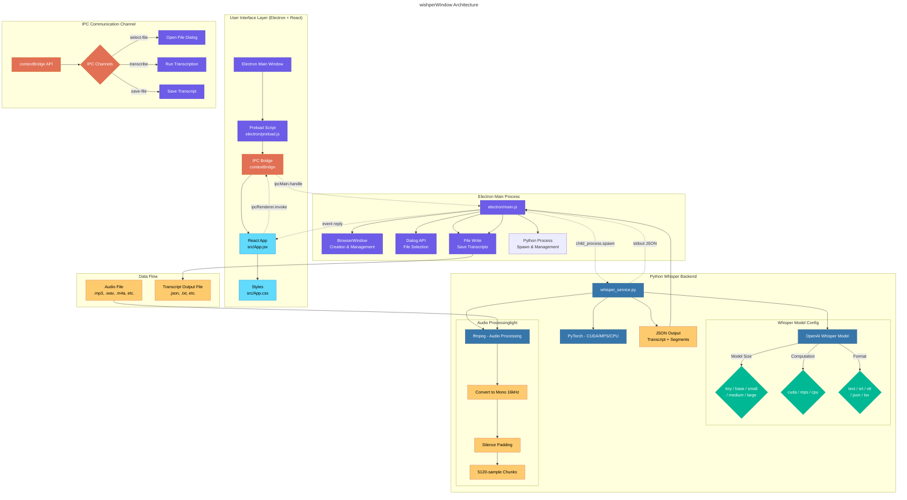

# wishperWindow - High-Level Architecture

## Component Overview

### 1. User Interface Layer (Electron + React)
- **Electron Main Window**: The desktop application window
- **Preload Script** (`electron/preload.js`): Exposes a secure API via `contextBridge` for IPC communication
- **React App** (`src/App.jsx`): The frontend UI built with React, featuring:
  - File selection button
  - Model configuration (size, device, output format)
  - Transcription results display
  - Save functionality

### 2. Electron Main Process (`electron/main.js`)
- Manages the BrowserWindow lifecycle
- Handles IPC channels:
  - `select-file`: Opens native file dialog for audio selection
  - `transcribe`: Spawns a Python child process to run Whisper
  - `save-file`: Saves transcription results to disk
- Spawns and manages the Python process

### 3. Python Whisper Backend (`python/whisper_service.py`)
- **Whisper Model**: OpenAI's Whisper automatic speech recognition model
- **PyTorch**: Deep learning framework (supports CUDA/MPS/CPU)
- **ffmpeg**: Handles audio format conversion, resampling to 16kHz mono
- **Output Formats**: JSON (with segments), text, SRT, VTT, TSV

### 4. Data Flow
1. User selects an audio file via the React UI
2. Electron opens a native file dialog
3. User configures Whisper parameters (model size, device, format)
4. Electron spawns a Python process with the selected audio file
5. Python processes the audio via ffmpeg, runs Whisper inference
6. Transcription results are returned as JSON via stdout
7. React UI displays the results
8. User can save the transcript to a file

## Technology Stack
| Component | Technology |
|-----------|------------|
| Desktop Shell | Electron |
| Frontend | React 18 + Vite |
| IPC Bridge | contextBridge (Electron) |
| ASR Model | OpenAI Whisper |
| ML Framework | PyTorch |
| Audio Processing | ffmpeg |
| Bundler | Vite |